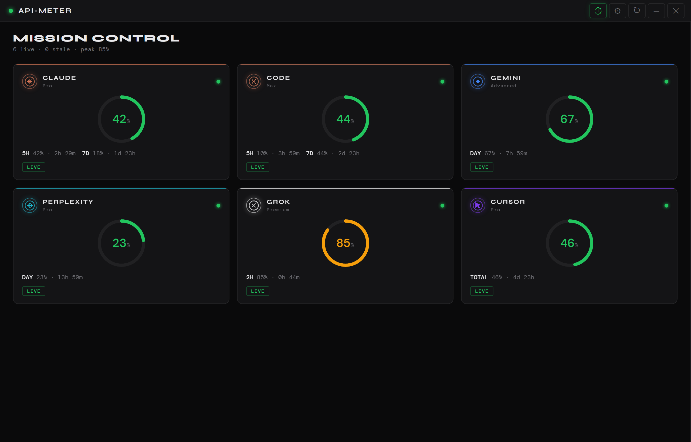
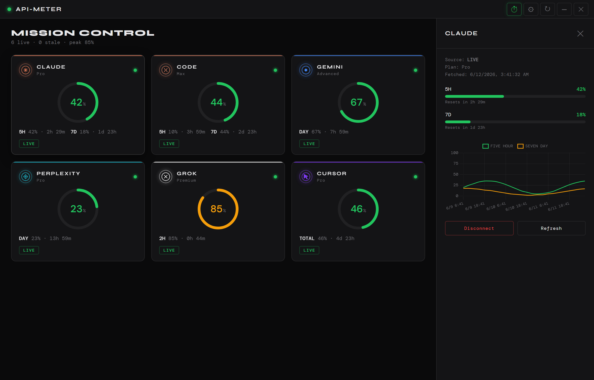
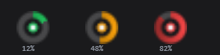
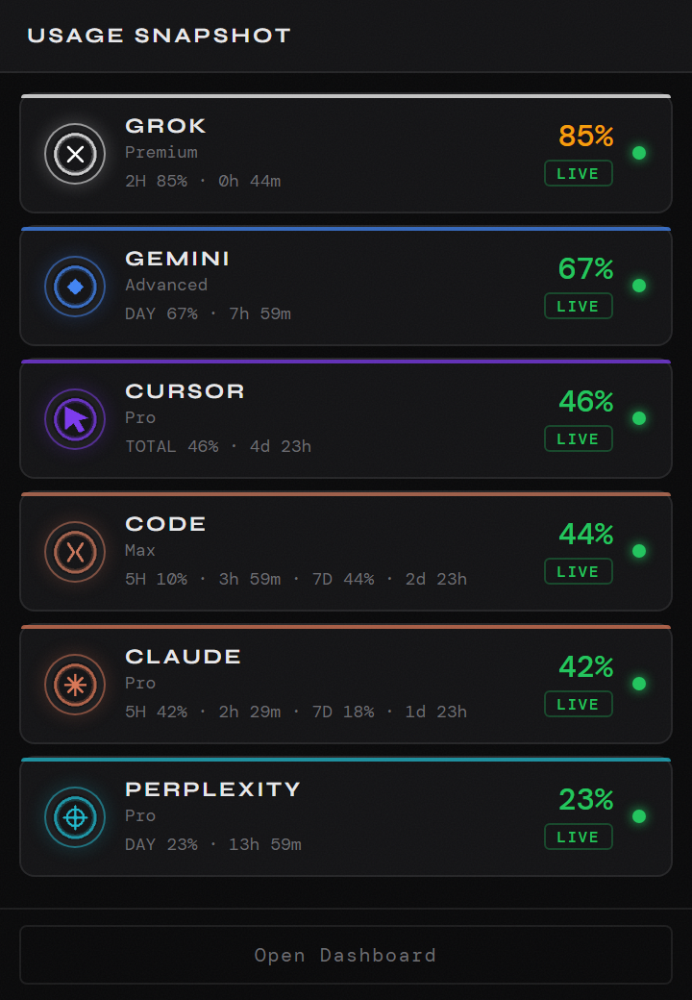
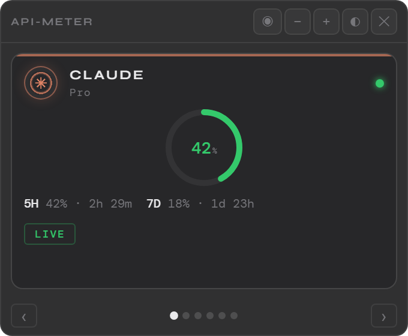
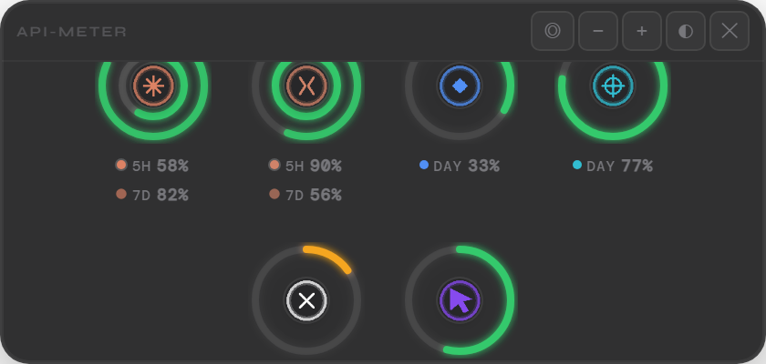
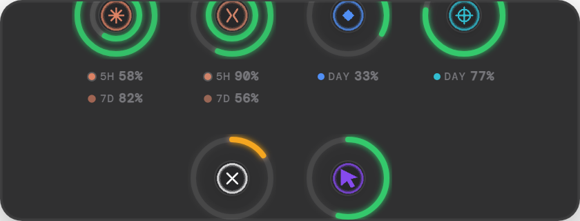
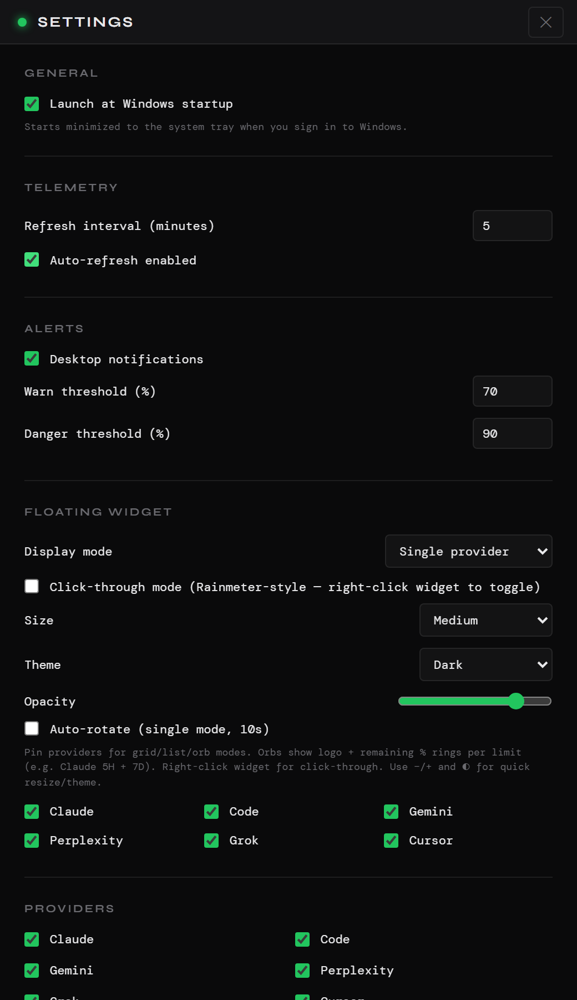

<p align="center">
  
</p>

<h1 align="center">API-Meter</h1>

<p align="center">
  <strong>One tray. Six providers. Zero tab-hopping.</strong><br>
  A Windows system-tray command center for AI usage limits — Claude, Gemini, Grok, Cursor, Perplexity, and more.
</p>

<p align="center">
  <a href="https://github.com/Hesamsamani/API-Meter/releases/latest"></a>
  
  
  
  
</p>

<p align="center">
  <a href="#-mission-control">Dashboard</a> ·
  <a href="#-features">Features</a> ·
  <a href="#-supported-providers">Providers</a> ·
  <a href="#-authentication">Auth</a> ·
  <a href="#-install">Install</a> ·
  <a href="#-development">Develop</a>
</p>

---

## 🎯 Overview

API-Meter lives in your **system tray** and polls provider dashboards on a schedule you control. Gauges shift **green → amber → red** as quotas fill. Open the full dashboard for history charts, or pin a frosted **floating widget** to your desktop.

| | |
| :--- | :--- |
| 🪟 **Tray-first** | Dynamic ring icon reflects worst-case utilization across all providers |
| 📊 **Live quotas** | Parsed from official usage pages — not guessed from session counts |
| 🔔 **Native alerts** | Warn / danger thresholds with Windows notifications |
| 🔒 **Local-only auth** | Sessions stored in your Electron profile — never sent to a third party |

---

## 🖥 Mission Control

Live gauges for every connected provider. Click a card to drill into quota windows, reset countdowns, and a seven-day utilization chart.

<p align="center">
  
</p>

<p align="center"><sub><em>Mission Control — all providers at a glance</em></sub></p>

<p align="center">
  
</p>

<p align="center"><sub><em>Detail view — per-window utilization, reset timers, and 7-day history</em></sub></p>

---

## ✨ Features

<table>
<tr>
<td width="50%" valign="top">

### 🎛 Tray workflow

- Ring icon fills with **worst-case utilization** across providers
- Color states: 🟢 green · 🟡 amber · 🔴 red
- **Single-click** → compact popover snapshot
- **Double-click** → full dashboard

<p align="center">
  
</p>

<p align="center">
  
</p>

</td>
<td width="50%" valign="top">

### ◎ Floating widget

Four display modes — **single**, **grid**, **compact list**, and **orb rings** (Rainmeter-style).

| Control | Action |
| :--- | :--- |
| **− / +** | Resize widget |
| **◐** | Cycle theme (dark / light) |
| **◎** | Cycle layout mode |
| **👆** | Click-through — floats above wallpaper, ignores mouse |

Position is remembered across hide, restart, and desktop pin.

<p align="center">
  
  
</p>

<p align="center">
  
</p>

</td>
</tr>
</table>

### ⚙️ Platform capabilities

| Capability | Detail |
| :--- | :--- |
| 🔄 **Auto-refresh** | Configurable interval (1–60 min); toggle from the titlebar |
| 📈 **Usage history** | SQLite-backed 7-day charts per provider |
| 🏷 **Display modes** | Show **used %** or **remaining %** on gauges and cards |
| 🧩 **Provider toggles** | Enable / disable any provider individually |
| 📌 **Widget pins** | Choose which providers appear in grid / orb modes |
| 🚀 **Launch at login** | Optional startup, begins minimized to tray |
| ⚠️ **Stale badges** | Clear error state when a live fetch fails; local fallback where available |

---

## 🧩 Supported providers

<p align="center">
  
  
  
  
  
  
</p>

| Provider | Windows tracked | Data source | Auth |
| :--- | :--- | :--- | :--- |
|  **Claude** | 5H · 7D · Sonnet · Opus | claude.ai API | Browser session |
|  **Claude Code** | 5H · 7D | Claude Code CLI session | CLI token |
|  **Gemini** | **5H** (current usage) · **WEEK** (weekly limit) | [Official usage page](https://gemini.google.com/usage?pageId=none) | Chrome sign-in or cookie paste |
|  **Perplexity** | PRO · RES · LABS | Perplexity API | Browser session |
|  **Grok** | Credits | Grok CLI session | `grok login` |
|  **Cursor** | TOTAL · AUTO · API | Cursor IDE tokens | IDE sign-in |

> **Gemini** reads the same limits shown on Google's usage page — rolling **5-hour current usage** and **weekly limit** with real reset times (`Resets at 10:04 AM`, `Resets Jun 16 at 11:04 AM`), not a legacy daily estimate.

Toggle providers under **Settings → Providers**. Manage sessions under **Settings → Accounts**.

<p align="center">
  
</p>

<p align="center"><sub><em>Settings — sidebar navigation across six panels</em></sub></p>

---

## 🔐 Authentication

API-Meter never proxies your credentials through a backend. Each provider adapter fetches directly from the official dashboard or CLI session you already own.

### Browser providers (Claude, Perplexity, …)

1. Open **Dashboard** → click **Login** on a provider card  
2. Sign in through the in-app browser  
3. Session cookies are stored in the local `persist:api-meter` partition  

### Gemini (Google)

Google blocks embedded OAuth. Gemini uses a dedicated flow:

| Method | Steps |
| :--- | :--- |
| 🌐 **Chrome sign-in** | Opens Chrome / Edge → sign in at gemini.google.com → **Import from browser** |
| 📋 **Paste cookies** | On gemini.google.com, export via **EditThisCookie** → paste JSON → **Import & connect** |

**Settings → Accounts** gives per-provider actions:

- **Re-login** — refresh session without clearing data  
- **Disconnect** — stop polling, keep settings  
- **Reset & sign in** (Gemini) — purge Google cookies and start fresh  

<details>
<summary><strong>🍪 Gemini cookie paste tips</strong></summary>

- Export the **full** EditThisCookie JSON array while signed in at `gemini.google.com`
- Required session cookies: `__Secure-1PSID`, `__Secure-3PSID`, `SID` (plus companion Google cookies)
- Paste the entire `[{...}, {...}, ...]` block — not a single cookie fragment
- If verification fails, export fresh cookies (sessions expire)

</details>

### CLI providers

| Provider | Setup |
| :--- | :--- |
| **Claude Code** | Run `claude` in terminal and authenticate |
| **Grok** | Run `grok login` in terminal |
| **Cursor** | Sign in through Cursor IDE |

---

## 📥 Install

### ⬇️ Portable (recommended)

1. Download **`API-Meter 0.1.0.exe`** from [**Releases**](https://github.com/Hesamsamani/API-Meter/releases/latest)
2. Run it — the app minimizes to the **system tray**
3. Right-click tray icon → **Open Dashboard** → connect providers via **Login**

> 🔒 Credentials live in your local Electron user-data folder. Nothing is transmitted except direct requests to provider dashboards you authenticate with.

### 🔧 Build from source

```bash
git clone https://github.com/Hesamsamani/API-Meter.git
cd API-Meter
npm install
npm start          # dev
npm test           # 152 unit tests
npm run build:win  # → dist/API-Meter 0.1.0.exe
```

**Requirements:** Node.js 18+, Windows 10/11.

---

## 🛠 Development

```bash
npm start                 # Electron dev
npm test                  # Node test runner (152 tests)
npm run icons:generate    # Regenerate app + tray gauge PNGs
npm run screenshots       # Regenerate README screenshots (Playwright)
npm run build:win         # Windows portable + installer
```

### 📁 Project layout

```
API-Meter/
├── main.js                 # App entry, IPC wiring
├── src/main/               # Tray, windows, scheduler, SQLite, auth
│   ├── gemini-cookie-jar.js   # Full-session restore for Gemini paste
│   └── fetch-via-window.js    # Headless page loads + usage-page parse
├── src/providers/          # Per-provider fetch + parse adapters
├── src/shared/             # Usage-page parsers, widget presets, gauges
├── src/renderer/           # Dashboard, settings, widget, tray popover
├── assets/                 # App icon, tray gauges, provider logos
├── docs/screenshots/       # README imagery
└── tests/                  # Provider + main-process unit tests
```

### 🎨 Tray icon gauge

Tray icons are generated with `scripts/generate-icons.js` and updated at runtime by `tray-icon-buffer.js` — the ring arc reflects aggregate utilization and shifts color at warn / danger thresholds.

### 🧪 Adding a provider

1. Create `src/providers/your-provider.js` returning the normalized snapshot shape  
2. Register in `src/providers/registry.js`  
3. Add tests under `tests/providers/`  
4. Add logo PNG to `assets/providers/`  

See [CONTRIBUTING.md](CONTRIBUTING.md) for the full checklist.

---

## 🤝 Contributing

Bug reports and pull requests are welcome.

1. Fork → branch → `npm test` → PR  
2. Keep provider parsers isolated under `src/providers/`  
3. Regenerate screenshots after UI changes: `npm run screenshots`  
4. Never commit cookies, tokens, or personal session data  

---

## 📄 License

[MIT](LICENSE) — © 2026 [Hesam Samani](https://github.com/Hesamsamani)

<p align="center">
  <sub>Built for people who hit rate limits at 2 AM and need to know <em>which</em> provider is the culprit.</sub>
</p>